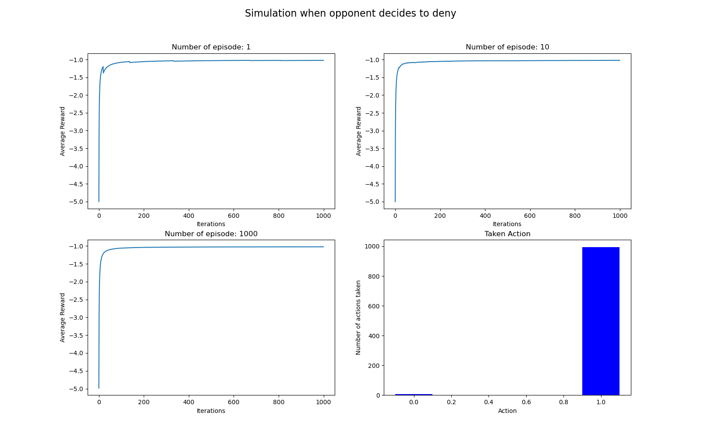
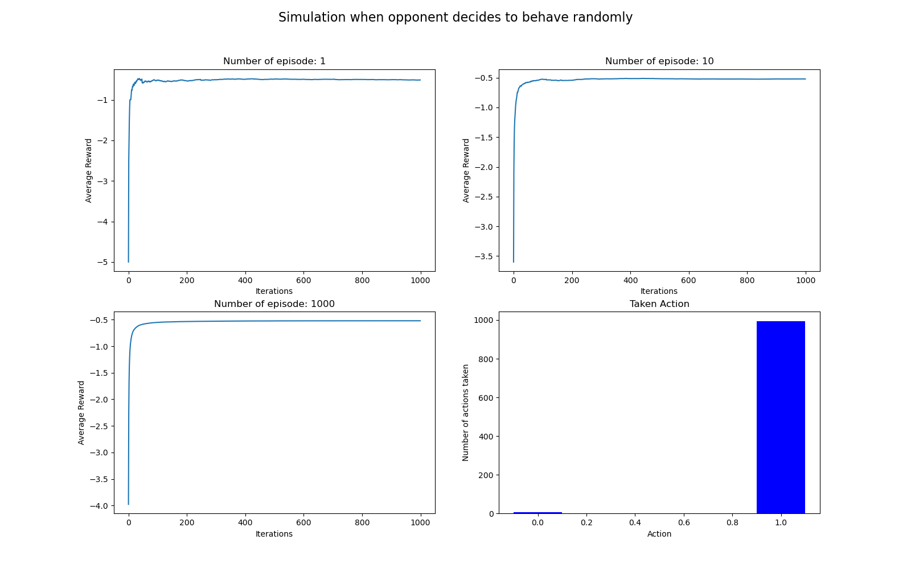

In prisoner's dilemma problem, if opponent is not an RL agent, then finding the best action will be a 2-armed bandit problem. 
Here one arm is to Confess, other arm is to deny

In this program, let,
  Confess denotes 'C' == 0
  Deny denotes    'D' == 1

 Payoff matrix:
  
  (confess, confess): ('C', 'C') == (-3, -3)
  (confess, deny)   : ('C', 'D') == (-5, 0)
  (deny, confess)   : ('D', 'C') == (0, -5)
  (deny, deny)      : ('D', 'D') == (-1, -1)
  
  Where, first element is action of our RL agent and second element is action of opponent.

Output:
  For each experiments, RL agent learns to deny in short time, which is the dominant action.
  This experiment has been done for 3 types of opponents - always confesses, always denies, behaves randomly.

  When opponent always confesses, average reward reaches up to 0 after all iterations. 
  
  When opponent always denies, average reward reaches up to -1 after all iterations. 

  This is for opponent with random strategy
